# Ray Tracer

[](https://github.com/hockeybuggy/ray_tracer/actions?query=workflow%3A%22Build+and+Test%22+branch%3Amaster)
[](https://github.com/hockeybuggy/ray_tracer/actions?query=workflow%3A%22Check+Formatting%22+branch%3Amaster)

This repository is just me working through the exercises in ["The Ray Tracer
Challenge" by Jamis Buck](https://pragprog.com/book/jbtracer/the-ray-tracer-challenge).

Quite a bit of it is just me trying to get better at Rust.


## Getting started

Start off by cloning the repo. You'll also need a version of Rust and Cargo
(consider using `rustup` to install this).


## Running tests

To run the unit tests and the end to end tests.

```sh
cargo test
```

If one of the end to end tests produces a different result from the reference
image in the `tests/fixtures` directory the result will be written into the
root of the project directory. The mechanism can be use for rendering higher
resolution version of the scenes in the tests by changing the `SCALE` constant
at the top of the test then running the test.


## Gallery

These are some of the scenes the ray tracer can render. The size of these
images are small because these images are used as fixtures that tests use to
compare to the results they generate and smaller images are faster to render.

### The basics

<table>
  <tr>
    <th>
      <p>Name</p>
      
    </th>
    <th>
      <p>Image</p>
    </th>
  <tr>
  <tr>
    <td>Simple Circle</td>
    <td>
      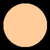
    </td>
  </tr>

  <tr>
    <td>Simple Sphere</td>
    <td>
      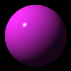
    </td>
  </tr>

  <tr>
    <td>Translated Sphere</td>
    <td>
      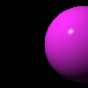
    </td>
  </tr>
</table>


### Patterns

<table>
  <tr>
    <th>
      <p>Name</p>
      
    </th>
    <th>
      <p>Image</p>
    </th>
  </tr>

  <tr>
    <td>Checkered Sphere</td>
    <td>
      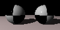
    </td>
  </tr>

  <tr>
    <td>Gradient Sphere</td>
    <td>
      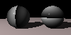
    </td>
  </tr>

  <tr>
    <td>Ring Sphere</td>
    <td>
      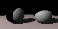
    </td>
  </tr>

  <tr>
    <td>Stripe Sphere</td>
    <td>
      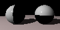
    </td>
  </tr>
</table>

### Worlds

<table>
  <tr>
    <th>
      <p>Name</p>
      
    </th>
    <th>
      <p>Image</p>
    </th>
  </tr>

  <tr>
    <td>World floor</td>
    <td>
      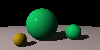
    </td>
  </tr>

  <tr>
    <td>Simple World</td>
    <td>
      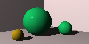
    </td>
  </tr>


  <tr>
    <td>World with non reflective checkered floor</td>
    <td>
      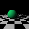
    </td>
  </tr>

  <tr>
    <td>World with reflective checkered floor</td>
    <td>
      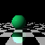
    </td>
  </tr>

  <tr>
    <td>World with reflective floor</td>
    <td>
      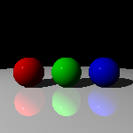
    </td>
  </tr>

  <tr>
    <td>World with reflective floor and spheres</td>
    <td>
      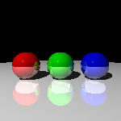
    </td>
  </tr>

  <tr>
    <td>World glass sphere</td>
    <td>
      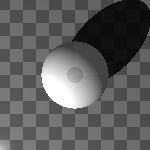
    </td>
  </tr>

</table>


## Running benchmarks

This project contains benchmarks which measure the performance and allow you to
compare how quickly the ray tracer is able to render scenes.

```sh
cargo bench
```

This will output something like:

```
render simple world     time:   [48.247 ms 48.335 ms 48.427 ms]
                        change: [-1.7688% -1.3561% -0.9619%] (p = 0.00 < 0.05)
                        Change within noise threshold.
Found 1 outliers among 100 measurements (1.00%)
  1 (1.00%) high severe
```

This will compare a bench mark to the previous results. This allows you to make
a change that you expect to improve performance and know if it worked on not.


## Possible improvements

- Add multiple light sources (note for this on 138 of the book).
- Builder interface for shapes.
- Update setting of transformation matrices
- Add a file input method for world description
- Create animated gifs
