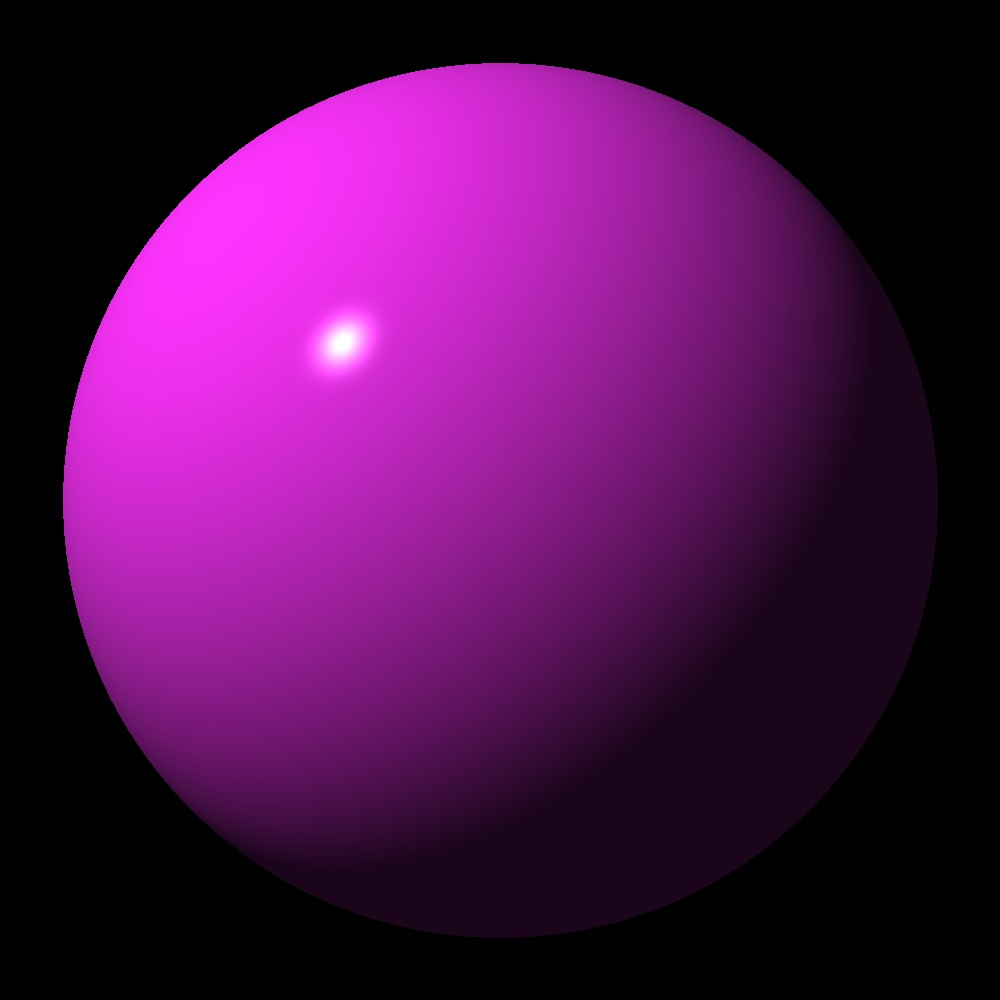

# Ray Tracer

This repository is just me working through the exercises in ["The Ray Tracer
Challenge" by Jamis Buck](https://pragprog.com/book/jbtracer/the-ray-tracer-challenge).

Quite a bit of it is just me trying to get better at Rust.

## Running

To get started clone the repository then run:

    cargo test

## Possible improvements

- Only have one interface for transformations. Right now I export the
  functions, but it may may sense to just have them as methods on matrices.
- Experiment with different types for point tuples and vector tuples.
- Update the test that write files to use tempfiles.
- Use a more compact (and more supported format than PPM).
- Builder interface for worlds.
- Builder interface for shapes.
- Fix black border in camera rendering
