# Ray Tracer

[](https://github.com/hockeybuggy/ray_tracer/actions?query=workflow%3A%22Build+and+Test%22+branch%3Amaster)
[](https://github.com/hockeybuggy/ray_tracer/actions?query=workflow%3A%22Check+Formatting%22+branch%3Amaster)

This repository is just me working through the exercises in ["The Ray Tracer
Challenge" by Jamis Buck](https://pragprog.com/book/jbtracer/the-ray-tracer-challenge).

Quite a bit of it is just me trying to get better at Rust.

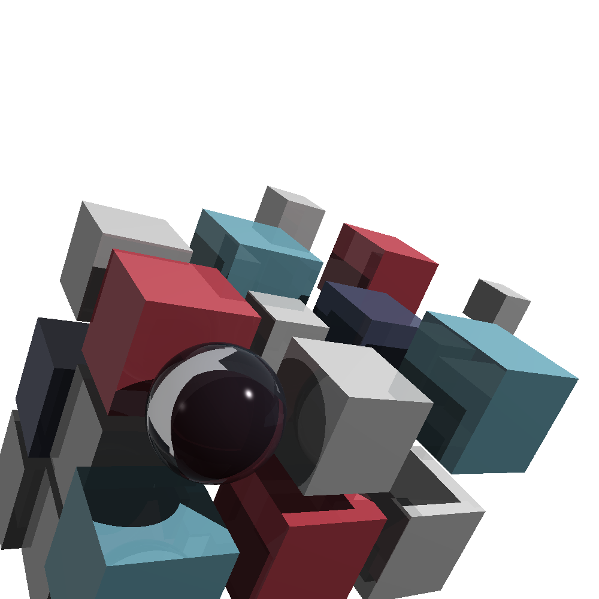


## Getting started

Start off by cloning the repo. You'll also need a version of Rust and Cargo
(consider using `rustup` to install this).


## Running tests

To run the unit tests and the end to end tests.

```sh
cargo test
```

If one of the end to end tests produces a different result from the reference
image in the `tests/fixtures` directory the result will be written into the
root of the project directory. The mechanism can be use for rendering higher
resolution version of the scenes in the tests by changing the `SCALE` constant
at the top of the test then running the test.


## Gallery

These are some of the scenes the ray tracer can render. The size of these
images are small because these images are used as fixtures that tests use to
compare to the results they generate and smaller images are faster to render.

### The basics

<table>
  <tr>
    <th>
      <p>Name</p>
      
    </th>
    <th>
      <p>Image</p>
    </th>
  <tr>
  <tr>
    <td>Simple Circle</td>
    <td>
      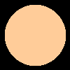
    </td>
  </tr>

  <tr>
    <td>Simple Sphere</td>
    <td>
      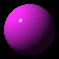
    </td>
  </tr>

  <tr>
    <td>Translated Sphere</td>
    <td>
      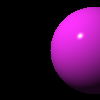
    </td>
  </tr>

  <tr>
    <td>Simple Cube</td>
    <td>
      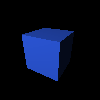
    </td>
  </tr>

  <tr>
    <td>Simple Cylinder</td>
    <td>
      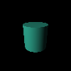
    </td>
  </tr>

  <tr>
    <td>Open Cylinder</td>
    <td>
      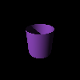
    </td>
  </tr>

  <tr>
    <td>Simple Cone</td>
    <td>
      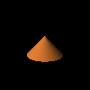
    </td>
  </tr>

  <tr>
    <td>Open Cone</td>
    <td>
      
    </td>
  </tr>

  <tr>
    <td>Simple Plane</td>
    <td>
      
    </td>
  </tr>
</table>


### Patterns

<table>
  <tr>
    <th>
      <p>Name</p>
      
    </th>
    <th>
      <p>Image</p>
    </th>
  </tr>

  <tr>
    <td>Checkered Sphere</td>
    <td>
      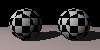
    </td>
  </tr>

  <tr>
    <td>Gradient Sphere</td>
    <td>
      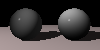
    </td>
  </tr>

  <tr>
    <td>Ring Sphere</td>
    <td>
      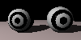
    </td>
  </tr>

  <tr>
    <td>Ring Cylinder</td>
    <td>
      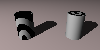
    </td>
  </tr>

  <tr>
    <td>Stripe Sphere</td>
    <td>
      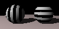
    </td>
  </tr>

  <tr>
    <td>Checkered Cube</td>
    <td>
      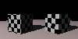
    </td>
  </tr>

  <tr>
    <td>Stripe Cube</td>
    <td>
      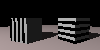
    </td>
  </tr>
</table>

### Texture mapping

<table>
  <tr>
    <th>
      <p>Name</p>
      
    </th>
    <th>
      <p>Image</p>
    </th>
  </tr>

  <tr>
    <td>UV Checkered Sphere</td>
    <td>
      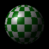
    </td>
  </tr>

  <tr>
    <td>UV Checkered Plane</td>
    <td>
      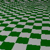
    </td>
  </tr>

  <tr>
    <td>UV Checkered Cylinder</td>
    <td>
      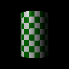
    </td>
  </tr>

  <tr>
    <td>Align Check Plane</td>
    <td>
      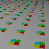
    </td>
  </tr>

  <tr>
    <td>UV Mapped Cube</td>
    <td>
      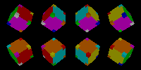
    </td>
  </tr>

  <tr>
    <td>Earth</td>
    <td>
      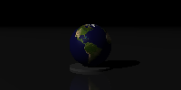
    </td>
  </tr>

  <tr>
    <td>Skybox</td>
    <td>
      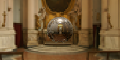
    </td>
  </tr>
</table>

### Worlds

<table>
  <tr>
    <th>
      <p>Name</p>
      
    </th>
    <th>
      <p>Image</p>
    </th>
  </tr>

  <tr>
    <td>World floor</td>
    <td>
      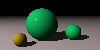
    </td>
  </tr>

  <tr>
    <td>Simple World</td>
    <td>
      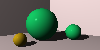
    </td>
  </tr>


  <tr>
    <td>World with non reflective checkered floor</td>
    <td>
      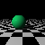
    </td>
  </tr>

  <tr>
    <td>World with reflective checkered floor</td>
    <td>
      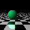
    </td>
  </tr>

  <tr>
    <td>World with reflective floor</td>
    <td>
      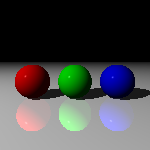
    </td>
  </tr>

  <tr>
    <td>World with reflective floor and spheres</td>
    <td>
      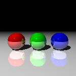
    </td>
  </tr>

  <tr>
    <td>World glass sphere</td>
    <td>
      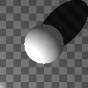
    </td>
  </tr>

  <tr>
    <td>World made of cubes</td>
    <td>
      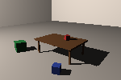
    </td>
  </tr>

  <tr>
    <td>Cylinders and cones</td>
    <td>
      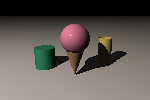
    </td>
  </tr>

  <tr>
    <td>Multiple lights</td>
    <td>
      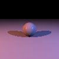
    </td>
  </tr>

  <tr>
    <td>Hexagon</td>
    <td>
      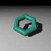
    </td>
  </tr>

  <tr>
    <td>Teapot</td>
    <td>
      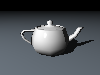
    </td>
  </tr>

  <tr>
    <td>Teapot (high resolution)</td>
    <td>
      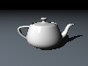
    </td>
  </tr>

  <tr>
    <td>Cow</td>
    <td>
      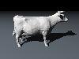
    </td>
  </tr>

  <tr>
    <td>Teddy</td>
    <td>
      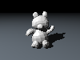
    </td>
  </tr>

  <tr>
    <td>Constructive solid geometry</td>
    <td>
      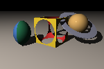
    </td>
  </tr>

  <tr>
    <td>Dice</td>
    <td>
      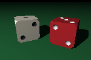
    </td>
  </tr>

  <tr>
    <td>Area light (soft shadows)</td>
    <td>
      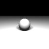
    </td>
  </tr>

  <tr>
    <td>The book cover</td>
    <td>
      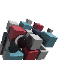
    </td>
  </tr>

  <tr>
    <td>Spotlight</td>
    <td>
      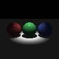
    </td>
  </tr>

  <tr>
    <td>Spotlight (narrow beam)</td>
    <td>
      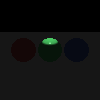
    </td>
  </tr>

  <tr>
    <td>Spotlight (wide beam)</td>
    <td>
      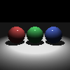
    </td>
  </tr>

  <tr>
    <td>Spotlight (side lit)</td>
    <td>
      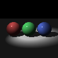
    </td>
  </tr>

</table>


## Rendering scenes

Scenes can also be described in TOML files instead of Rust (see
`scenes/*.toml` for examples). The `render` binary reads one and writes a
PNG:

```sh
cargo run --release --bin render -- scenes/<scene>.toml
```

`--scale N` multiplies the scene's base resolution, so the same file can
render small while iterating and large for a shareable image. `--output
PATH` picks the output path (the default is `<name>.png`).

A scene file has a `[scene]` table naming the render and giving its base
size, a `[camera]`, and any number of `[[lights]]` and `[[objects]]`:

```toml
[scene]
name = "example"
width = 100
height = 100

[camera]
field_of_view = 60.0     # degrees
from = [0.0, 2.5, -7.0]  # where the camera sits
to = [0.0, 1.0, 0.0]     # what it looks at
up = [0.0, 1.0, 0.0]

[[lights]]
position = [-8.0, 6.0, -6.0]
intensity = [1.0, 1.0, 1.0]  # rgb

# Objects have a unique name; a kind (`plane`, `sphere`, `cube`, or `obj`
# with a `file` path to an OBJ model); an optional list of transform
# steps; and optional material overrides.
[[objects]]
name = "ball"
kind = "sphere"
transform = [{ scale = [0.5, 0.5, 0.5] }, { translate = [0.0, 1.0, 0.0] }]
material = { color = [0.9, 0.2, 0.2], specular = 0.3 }
```

Transform steps (`rotate_x`/`rotate_y`/`rotate_z` in degrees, `scale`, and
`translate`) apply in list order, each in world space after the ones
before it. Material overrides apply on top of the default material:
`color`, `ambient`, `diffuse`, `specular`, `shininess`, `reflective`,
`transparency`, and `refractive_index`.


## Rendering animations

An animation file (see `animations/*.toml`) uses the same format with an
`[animation]` table in place of `[scene]`, followed by a list of
`[[frames]]`. Each frame restates how it differs from the base scene:
extra transform steps appended after an object's base transform, or
replacement camera coordinates. An empty `[[frames]]` entry renders the
base scene unchanged.

```toml
[[frames]]

[[frames]]
objects.teapot.transform = [{ rotate_y = 10.0 }]

[[frames]]
camera.from = [0.694593, 2.0, -3.939231]
```

The `animate` binary renders every frame, in parallel, to a numbered PNG:

```sh
cargo run --release --bin animate -- animations/<animation>.toml --scale 4
```

and `scripts/make_gif.sh` assembles the frames into a looping gif with
ffmpeg:

```sh
./scripts/make_gif.sh animations/frames/<animation> animations/<animation>.gif
```

For example, these are the frames of `tests/scenes/sphere_moves.toml`: the
first frame is the base scene, the second slides the sphere to the right,
and the third slides it further while pulling the camera up and back.

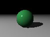 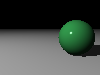 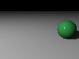

The two animations in `animations/` put the high-poly Utah teapot through
a full turn — first spinning the teapot in place, then orbiting the camera
around it while the light stays fixed:

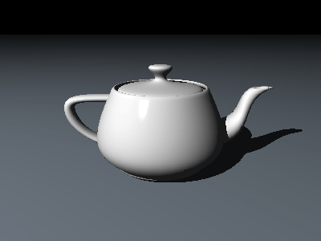 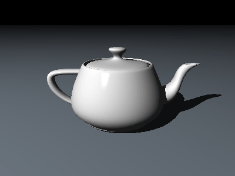


## Running benchmarks

This project contains benchmarks which measure the performance and allow you to
compare how quickly the ray tracer is able to render scenes.

```sh
cargo bench
```

This will output something like:

```
render simple world     time:   [48.247 ms 48.335 ms 48.427 ms]
                        change: [-1.7688% -1.3561% -0.9619%] (p = 0.00 < 0.05)
                        Change within noise threshold.
Found 1 outliers among 100 measurements (1.00%)
  1 (1.00%) high severe
```

This will compare a bench mark to the previous results. This allows you to make
a change that you expect to improve performance and know if it worked on not.


## Possible improvements

- Parallel rendering: the render loop casts each pixel's ray
  independently, so rows could be rendered across threads (e.g. with
  `rayon`) for a near-linear speedup on multi-core machines.
- Soft shadow example with the teapot
- Performance testing of the teapot render
- Higher resolution rendering of the earth scene
- Skybox and texture support for the scene definition DSL
- The dragon scene from the bounding box bonus chapter
- Focal blur
- Anti-aliasing
- Normal perturbations
- Torus primitive
